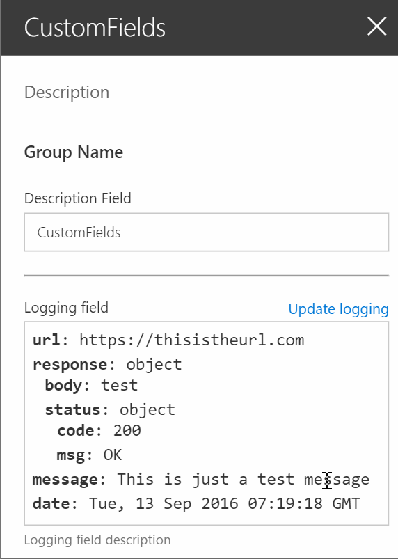

# Custom fields for the SharePoint Framework

## Field types
### Logging field
The logging field can be used to log any information about your web part. For example the logging field can be used to log information about a API call. That way you do not have to start debugging your code to see the responses.



## Using this field

```bash
git clone this repo
npm install
tsd install
gulp serve
```

## Versions
### 0.0.1
- Initial commit with the logging field.